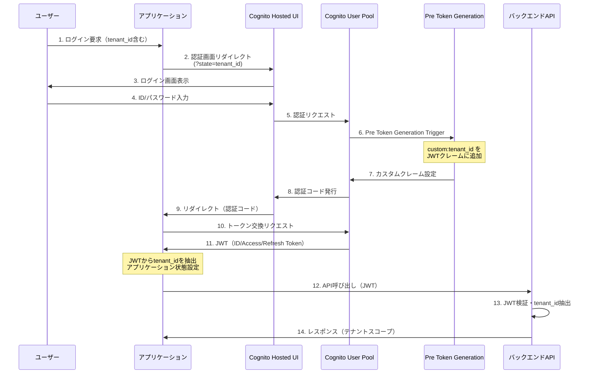
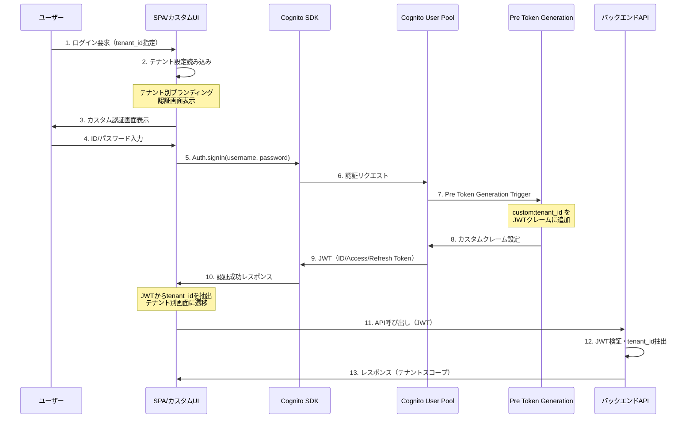
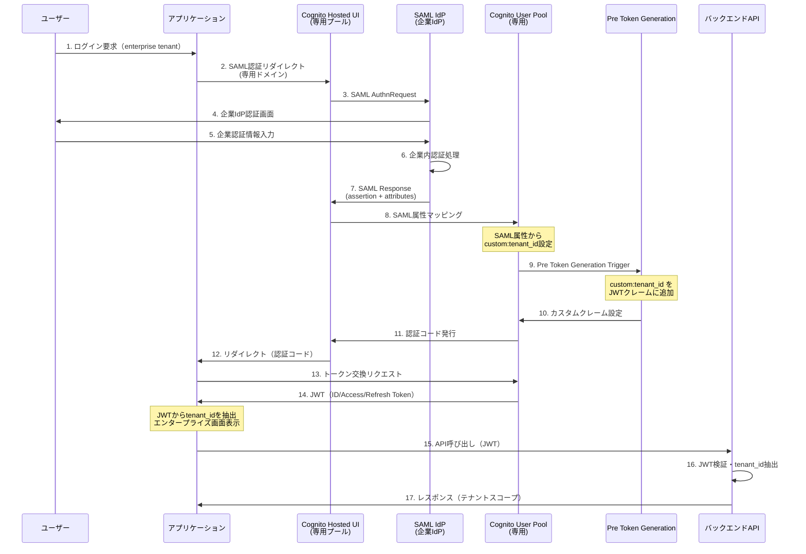
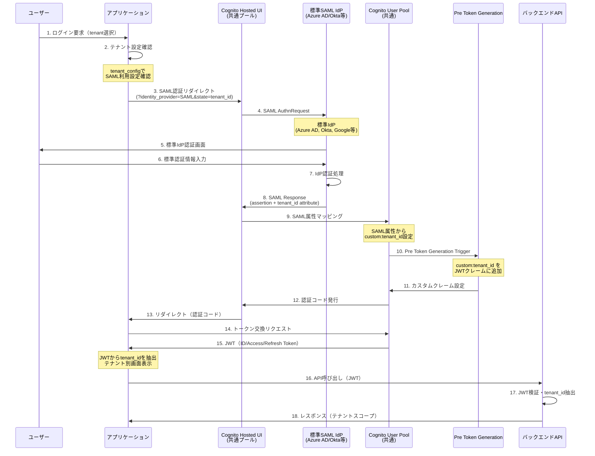

# 認証機能 機能要件定義書

## 概要

マルチテナント対応のSaaSアプリケーションにおいて、テナント分離された認証機能を提供する。

### 対象範囲
- ユーザー認証・認可
- テナント分離
- セッション管理
- 認証画面提供

## 機能要件

### 1. ユーザー管理

#### 1.1 基本要件
- **認証基盤**: AWS Cognito User Pool
- **アカウント単位**: テナント毎にユーザーアカウントを分離
- **ユーザー属性**: email, username, tenant_id（カスタム属性）

#### 1.2 ユーザープール構成
- **共通ユーザープール**
  - 標準テナント（Hosted UI認証）
  - カスタムUI認証テナント
  - 1つのユーザープールで複数テナントを管理
  
- **専用ユーザープール**
  - SAML IdP連携が必要なエンタープライズテナント
  - テナント毎に独立したユーザープール

#### 1.3 ユーザー登録・管理
- **管理者によるユーザー作成**: AdminCreateUser API
- **セルフサインアップ**: 無効化（招待制のみ）
- **パスワードポリシー**: 8文字以上、英数字組み合わせ
- **MFA**: オプショナル（テナント設定による）

### 2. テナント分離

#### 2.1 テナントID管理
- **カスタム属性**: `custom:tenant_id`でテナント情報を保持
- **JWT埋め込み**: Pre Token Generation Triggerでテナントクレーム追加
- **検証**: 各APIリクエストでテナントスコープを検証

#### 2.2 データ分離レベル
- **認証レベル**: JWTでテナント情報を確実に分離
- **APIレベル**: 全APIリクエストでテナント検証
- **データレベル**: DB操作時にテナントフィルター適用

### 3. 認証フロー

#### 3.1 ユーザーID・パスワード認証フロー

##### Phase 1: Hosted UI認証（MVP）



**対象テナント**: 全テナント（標準機能で十分）

##### Phase 2: カスタムUI認証



**対象テナント**: ブランディング要件が高いテナント

#### 3.2 SAML認証フロー

##### Phase 3A: 専用ユーザープール SAML認証



**対象テナント**: 既存SAML IdPを持つエンタープライズテナント

##### Phase 3B: 共通ユーザープール SAML認証（標準提供）



**対象テナント**: 標準SAML IdPを利用するテナント

#### 3.3 認証フロー選択ロジック

```javascript
const getAuthenticationFlow = (tenantId, userPreference) => {
  const tenantConfig = getTenantConfig(tenantId);
  
  // Phase 3: SAML認証
  if (tenantConfig.authType === 'saml') {
    if (tenantConfig.dedicatedUserPool) {
      return 'dedicated-saml';  // 専用ユーザープール
    } else {
      return 'shared-saml';     // 共通ユーザープール
    }
  }
  
  // Phase 2: カスタムUI認証
  if (tenantConfig.authType === 'custom') {
    return 'custom-ui';
  }
  
  // Phase 1: 標準Hosted UI認証（デフォルト）
  return 'hosted-ui';
};
```

### 4. 認証画面要件

#### 4.1 Hosted UI（Phase 1）
- **基本機能**: ログイン、パスワードリセット
- **カスタマイズ**: ロゴ、色設定のみ
- **URL構成**: `https://{domain}.auth.{region}.amazoncognito.com/login?state={tenant_id}`

#### 4.2 カスタムUI（Phase 2）
- **実装方式**: React SPA + Cognito SDK
- **カスタマイズ**: テナント毎のブランディング対応
- **URL構成**: `https://app.domain.com/auth/{tenant_id}`

#### 4.3 SAML UI（Phase 3）
- **実装方式**: 専用ユーザープール + SAML IdP
- **URL構成**: `https://{tenant}.auth.{region}.amazoncognito.com/saml2/idpresponse`

### 5. JWT設計

#### 5.1 標準クレーム
```json
{
  "sub": "user-uuid",
  "email": "user@example.com",
  "aud": "cognito-client-id",
  "exp": 1234567890,
  "iat": 1234567890
}
```

#### 5.2 カスタムクレーム
```json
{
  "tenant_id": "tenant-123",
  "tenant": "tenant-123"
}
```

#### 5.3 トークンの種類と用途

##### ID Token
- **用途**: ユーザー認証情報の提供
- **内容**: ユーザーID、メールアドレス、カスタムクレーム（tenant_id等）
- **対象**: フロントエンドアプリケーション
- **形式**: JWT（署名付き）
- **検証**: 署名検証により改ざん検出
- **用途例**: ユーザー情報表示、アクセス制御判定

```json
{
  "sub": "user-uuid",
  "email": "user@example.com",
  "tenant_id": "tenant-123",
  "aud": "cognito-client-id",
  "exp": 1234567890,
  "token_use": "id"
}
```

##### Access Token
- **用途**: APIアクセス認可
- **内容**: スコープ、権限情報
- **対象**: バックエンドAPI
- **形式**: JWT（署名付き）
- **検証**: API Gatewayや各APIで署名検証
- **用途例**: API呼び出し時の認可ヘッダー

```json
{
  "sub": "user-uuid",
  "scope": "aws.cognito.signin.user.admin",
  "token_use": "access",
  "aud": "cognito-client-id",
  "exp": 1234567890
}
```

##### Refresh Token
- **用途**: トークンの更新
- **内容**: 暗号化されたトークン更新情報
- **対象**: バックエンド（自動更新処理）
- **形式**: 不透明な文字列（JWTではない）
- **検証**: Cognitoサービスでのみ検証
- **用途例**: ID Token・Access Tokenの自動更新

#### 5.4 トークン有効期限・更新戦略

##### 有効期限設定
- **ID Token**: 1時間
- **Access Token**: 1時間
- **Refresh Token**: 30日

##### 自動更新フロー
```
[アプリケーション] → [Refresh Token] → [Cognito]
     ↓
[新しいID Token + Access Token] ← [検証・更新]
```

##### セキュリティ考慮事項
- **短い有効期限**: 漏洩時の影響を最小化
- **自動更新**: ユーザーエクスペリエンスの向上
- **Refresh Token ローテーション**: セキュリティ強化のため定期的に更新

### 6. セキュリティ要件

#### 6.1 認証セキュリティ
- **JWT署名検証**: 必須
- **トークン有効期限**: 適切な設定
- **HTTPS通信**: 必須

#### 6.2 テナント分離セキュリティ
- **JWTテナント検証**: 全APIで実施
- **クロステナントアクセス**: 完全禁止
- **テナント情報改ざん**: JWT署名で防止

### 7. 非機能要件

#### 7.1 可用性
- **SLA**: 99.9%（AWS Cognitoの可用性に依存）
- **障害対応**: AWS基盤のため自動復旧

#### 7.2 パフォーマンス
- **認証レスポンス**: 3秒以内
- **JWT検証**: 100ms以内
- **同時ユーザー**: 1000ユーザー/テナント

#### 7.3 スケーラビリティ
- **ユーザー数**: 10,000ユーザー/テナント
- **テナント数**: 1,000テナント（共通ユーザープール）
- **専用ユーザープール**: 100プール（AWS上限考慮）

### 8. 運用要件

#### 8.1 ユーザー管理運用
- **ユーザー招待**: 管理画面からの招待機能
- **パスワードリセット**: セルフサービス対応
- **アカウント無効化**: 管理者による即座の無効化

#### 8.2 テナント管理運用
- **テナント作成**: 自動プロビジョニング
- **認証方式変更**: Hosted UI ↔ カスタムUI の切り替え
- **SAML設定**: テナント毎のSAML IdP設定管理

#### 8.3 監視・ログ
- **認証ログ**: CloudWatch Logs
- **失敗ログ**: セキュリティ監視
- **パフォーマンス**: レスポンス時間監視

### 9. 段階的実装計画

#### Phase 1: MVP（スモールスタート）
- [ ] 共通ユーザープール構築
- [ ] Hosted UI設定
- [ ] Pre Token Generation Lambda
- [ ] 基本的なテナント分離

#### Phase 2: カスタマイズ対応
- [ ] カスタムUI開発
- [ ] テナント別認証画面振り分け
- [ ] ブランディング対応

#### Phase 3: エンタープライズ対応
- [ ] 専用ユーザープール対応
- [ ] SAML IdP連携
- [ ] 高度なセキュリティ機能

### 10. 制約事項

#### 10.1 AWS制約
- **ユーザープール上限**: リージョン毎に1000プール
- **ユーザー数上限**: プール毎に数百万ユーザー
- **SAML IdP**: プール毎に複数設定可能

#### 10.2 設計制約
- **テナント情報**: JWTに含めるため、機密情報は不可
- **認証方式変更**: ユーザーの再ログインが必要
- **マルチテナント所属**: 1ユーザー1テナントのみ対応