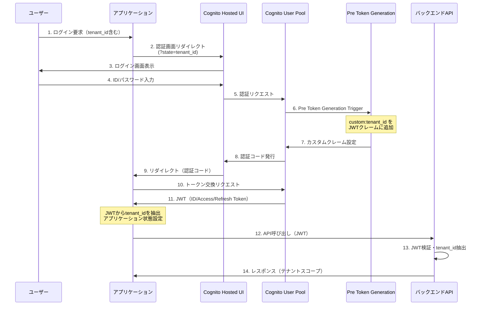
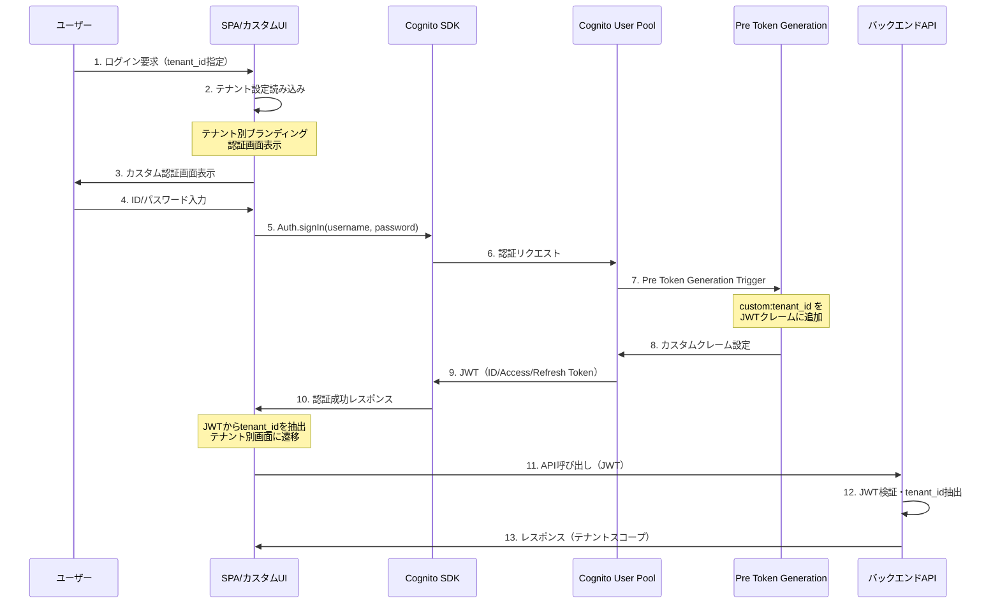
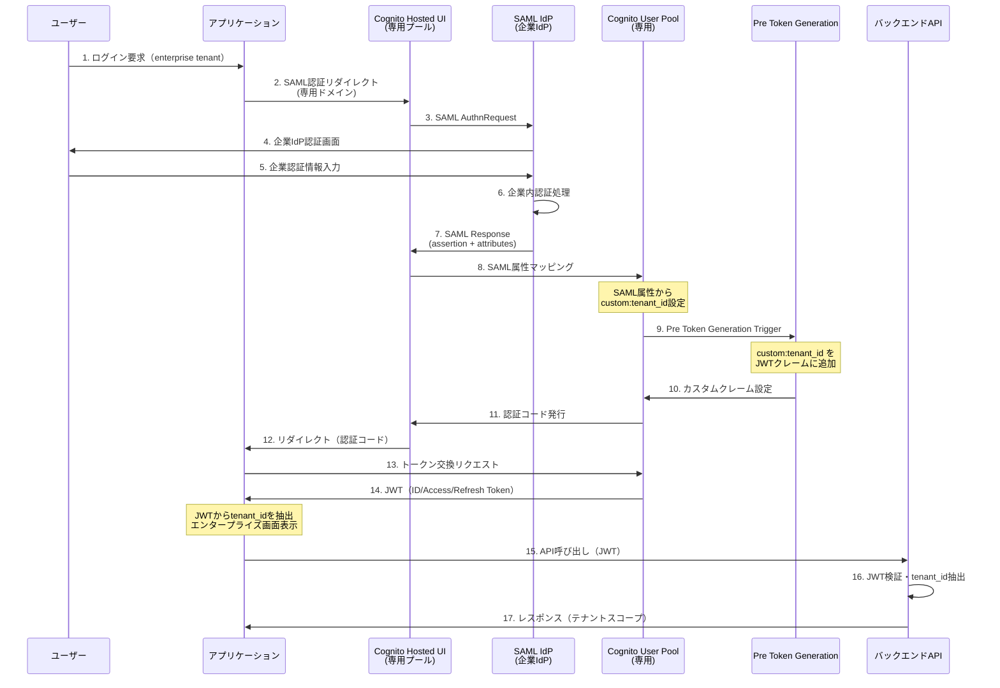
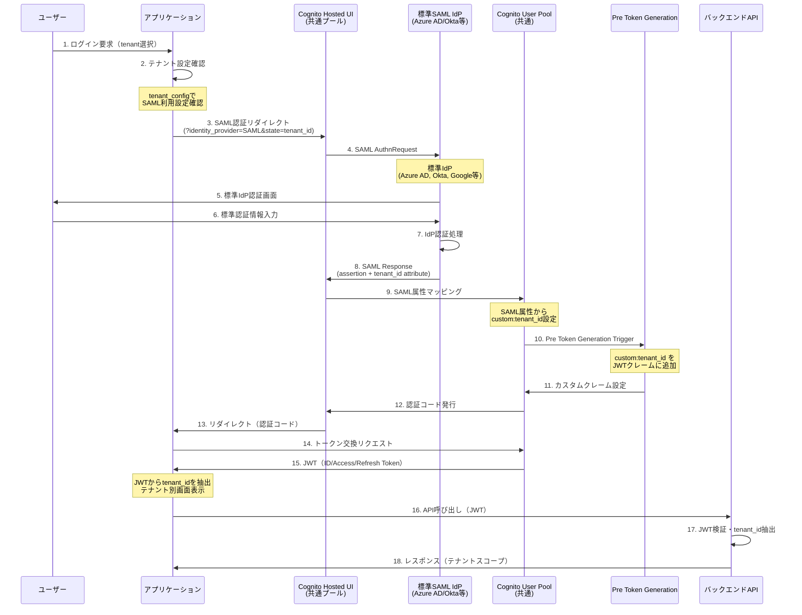

# 認証機能 機能要件定義書

## 概要

本システムでは、複数のテナント（顧客企業）が同一のSaaSプラットフォームを利用するマルチテナント構成を採用している。そのため、認証システムにおいても各テナントのデータとアクセス権限を完全に分離する必要がある。

本書では、このマルチテナント環境における認証機能の要件を定義する。特に、テナント間のデータ漏洩を防ぐためのセキュリティ設計と、将来的な機能拡張を見据えた段階的な実装アプローチについて詳述する。

### 対象範囲

本認証システムが対象とする機能範囲は以下の通りである：

- **ユーザー認証・認可**: ログイン認証とリソースアクセス権限の管理
- **テナント分離**: 各テナントのユーザーとデータの完全な分離
- **セッション管理**: セキュアで効率的なユーザーセッションの維持
- **認証画面提供**: 多様なテナント要件に対応する認証インターフェース

なお、パスワードポリシーの詳細設定や多要素認証（MFA）の具体的な運用については、各テナントの要求に応じて個別に調整可能とする。

## 機能要件

### 1. ユーザー管理の基本方針

#### 1.1 認証基盤の選択理由

本システムでは、AWS Cognito User Poolを認証基盤として採用する。この選択には以下のような理由がある。

まず、Cognitoはマネージドサービスとして提供されるため、セキュリティパッチの適用や可用性の確保をAWSに委任できる。これにより、開発チームは認証機能の実装よりもビジネスロジックの開発により多くのリソースを割くことができる。

また、Cognitoはマルチテナント対応に必要なカスタム属性やJWTトークンのカスタマイズ機能を標準で提供している。特に、Pre Token Generation Lambdaトリガーを活用することで、認証時にテナント情報をJWTクレームに埋め込むことが可能であり、後続のAPI処理において確実なテナント分離を実現できる。

さらに、将来的にSAML IdPとの連携が必要となった場合も、Cognitoの標準機能として対応可能である。これにより、エンタープライズ顧客の要求にも柔軟に対応できる。

#### 1.2 ユーザープール構成の考え方

ユーザープールの構成については、運用コストとセキュリティ要件のバランスを考慮して以下のような方針とする。

**共通ユーザープール**では、標準的なテナントを統合管理する。これには、Hosted UIで十分な認証要件を満たすテナントや、カスタムUIが必要だがSAML連携は不要なテナントが含まれる。共通プールの利用により、運用コストを大幅に削減できる一方、テナント分離はカスタム属性とJWTクレームで確実に実現する。

一方、**専用ユーザープール**は、既存のSAML IdPとの連携が必須となるエンタープライズテナント向けに提供する。このようなテナントでは、企業のセキュリティポリシーや既存のIDaaS基盤との統合が重要であり、専用プールによる完全な分離が求められる場合が多い。

ただし、AWS Cognitoには1リージョンあたり1000プールの上限があるため、専用プールの提供は真に必要な場合に限定し、可能な限り共通プールでの対応を推奨する。

#### 1.3 ユーザー登録・管理の運用方針

ユーザー管理については、セキュリティを重視した招待制のアプローチを採用する。セルフサインアップ機能は無効化し、テナント管理者による招待のみでユーザー登録を行う。これにより、不正なユーザー登録を防ぎ、各テナントが自社のメンバーのみを適切に管理できる体制を構築する。

具体的なユーザー作成は、AdminCreateUser APIを通じて行う。この方式により、初期パスワードの安全な配布や、ユーザーの初回ログイン時の強制パスワード変更を実現できる。また、ユーザー作成時にテナントIDを`custom:tenant_id`属性として確実に設定することで、後続の認証プロセスにおけるテナント分離の基盤を確立する。

パスワードポリシーについては、最低8文字以上で英数字の組み合わせを必須とする基本的な設定からスタートし、テナントの要求に応じて記号の必須化や最小文字数の増加などの調整を行う。多要素認証（MFA）は、標準ではオプショナルとするが、セキュリティ要件の高いテナントでは必須設定に変更可能とする。

### 2. テナント分離の実装戦略

#### 2.1 テナントID管理の仕組み

本システムにおけるテナント分離の核心は、ユーザー認証時にテナント情報を確実にJWTトークンに埋め込み、すべてのAPIリクエストでこの情報を検証することにある。

テナントIDの管理は、Cognitoのカスタム属性機能を活用して`custom:tenant_id`として保持する。この属性は、ユーザー作成時に設定され、ユーザーのライフサイクル全体を通じて変更されることはない。重要なポイントは、この属性値がCognitoによって管理されており、ユーザー自身が変更できない点である。

認証が成功した際には、Pre Token Generation Lambdaトリガーが自動的に実行され、`custom:tenant_id`の値をJWTのカスタムクレームとして追加する。このプロセスにより、認証後に発行されるすべてのJWTトークンには、確実にテナント情報が含まれることになる。

#### 2.2 多層防御によるデータ分離

テナント分離は、認証から実際のデータアクセスまで、複数の層で実施する多層防御の考え方に基づいて設計されている。

**認証レベル**では、JWTトークンの署名検証と併せてテナント情報の存在を確認する。署名が有効であってもテナント情報が含まれていない、または不正な形式の場合は、アクセスを拒否する。

**APIレベル**では、すべてのAPI エンドポイントでJWTからテナントIDを抽出し、リクエストの妥当性を検証する。この検証は、API Gatewayのオーソライザー機能を活用することで、各Lambda関数に到達する前に実行される。

**データレベル**では、データベースへのクエリ時に必ずテナントIDをフィルター条件として含める。これにより、仮にアプリケーションレベルでバグが発生した場合でも、異なるテナントのデータが混在することを防ぐ。また、DynamoDBのパーティションキーにテナントIDを含めることで、物理的なデータ分離も実現する。

### 3. 段階的な認証機能の実装アプローチ

認証機能の実装は、スモールスタートから段階的に機能を拡張していくアプローチを採用する。これにより、初期の開発コストを抑制しながら、将来の要件変化に柔軟に対応できる基盤を構築する。

#### 3.1 ユーザーID・パスワード認証フロー

##### Phase 1: Hosted UI認証（MVP）



**対象テナント**: 全テナント（標準機能で十分）

##### Phase 2: カスタムUI認証



**対象テナント**: ブランディング要件が高いテナント

#### 3.2 SAML認証フロー

##### Phase 3A: 専用ユーザープール SAML認証



**対象テナント**: 既存SAML IdPを持つエンタープライズテナント

##### Phase 3B: 共通ユーザープール SAML認証（標準提供）



**対象テナント**: 標準SAML IdPを利用するテナント

#### 3.3 認証フロー選択ロジック

```javascript
const getAuthenticationFlow = (tenantId, userPreference) => {
  const tenantConfig = getTenantConfig(tenantId);
  
  // Phase 3: SAML認証
  if (tenantConfig.authType === 'saml') {
    if (tenantConfig.dedicatedUserPool) {
      return 'dedicated-saml';  // 専用ユーザープール
    } else {
      return 'shared-saml';     // 共通ユーザープール
    }
  }
  
  // Phase 2: カスタムUI認証
  if (tenantConfig.authType === 'custom') {
    return 'custom-ui';
  }
  
  // Phase 1: 標準Hosted UI認証（デフォルト）
  return 'hosted-ui';
};
```

### 4. 認証画面の実装戦略とテナント要件

認証画面の実装においては、テナントの多様な要件に段階的に対応していくアプローチを採用する。初期段階では開発コストを最小限に抑え、その後の成長に合わせて機能を拡張していく方針である。

#### 4.1 Phase 1: Hosted UIによるスモールスタート

最初のフェーズでは、AWS Cognitoが提供するHosted UIを活用する。この選択により、認証画面の開発にかかる初期コストを大幅に削減し、早期のサービス提供が可能となる。

Hosted UIは、ログインとパスワードリセットの基本機能を標準で提供している。カスタマイズ可能な要素は限定的だが、ロゴの設定や基本的な色調の変更は可能であり、多くのテナントの初期要件を満たすことができる。

URL構成は`https://{domain}.auth.{region}.amazoncognito.com/login?state={tenant_id}`の形式となり、stateパラメータにテナントIDを含めることで、認証後のテナント判定を確実に行う。このシンプルな仕組みにより、複雑な実装を必要とせずにマルチテナント対応が実現できる。

#### 4.2 Phase 2: カスタムUIによるブランディング対応

サービスの成長とともに、独自のブランディングを重視するテナントからの要求が高まってくる。このようなニーズに対応するため、React SPAとCognito SDKを組み合わせたカスタム認証画面を提供する。

カスタムUIの実装により、テナント毎に異なるロゴ、色彩設定、レイアウトを適用できるようになる。また、認証フォームの項目追加や、利用規約の表示なども柔軟に対応可能となる。

URL構成は`https://app.domain.com/auth/{tenant_id}`とし、テナントIDを明示的にパスに含める。これにより、ユーザーがブックマークした場合でも、適切なテナントの認証画面が表示される。

#### 4.3 Phase 3: SAML連携によるエンタープライズ対応

エンタープライズ顧客の獲得を目指す段階では、既存のSAML IdPとの連携が必須要件となる場合が多い。このような要求に対応するため、専用ユーザープールを活用したSAML認証を提供する。

SAML連携では、企業の既存IDaaS基盤（Azure AD、Okta、Google Workspace等）との統合が可能となり、ユーザーは普段使用している企業アカウントでのシングルサインオンが実現できる。

URL構成は`https://{tenant}.auth.{region}.amazoncognito.com/saml2/idpresponse`とし、テナント専用のサブドメインを提供することで、完全に分離された認証環境を構築する。

### 5. JWTトークン設計と運用方針

#### 5.1 標準クレームの活用

JWTトークンの設計では、OIDC標準に準拠した基本的なクレーム構成から開始する。これにより、将来的な他システムとの連携やライブラリの活用において、標準的な仕様に基づいた安全な実装が可能となる。

```json
{
  "sub": "user-uuid",
  "email": "user@example.com",
  "aud": "cognito-client-id",
  "exp": 1234567890,
  "iat": 1234567890
}
```

標準クレームには、ユーザーの一意識別子（sub）、メールアドレス、オーディエンス（aud）、有効期限（exp）、発行時刻（iat）が含まれる。これらの情報により、基本的な認証・認可の仕組みを構築できる。

#### 5.2 カスタムクレーム
```json
{
  "tenant_id": "tenant-123",
  "tenant": "tenant-123"
}
```

#### 5.3 トークンの種類と用途

##### ID Token
- **用途**: ユーザー認証情報の提供
- **内容**: ユーザーID、メールアドレス、カスタムクレーム（tenant_id等）
- **対象**: フロントエンドアプリケーション
- **形式**: JWT（署名付き）
- **検証**: 署名検証により改ざん検出
- **用途例**: ユーザー情報表示、アクセス制御判定

```json
{
  "sub": "user-uuid",
  "email": "user@example.com",
  "tenant_id": "tenant-123",
  "aud": "cognito-client-id",
  "exp": 1234567890,
  "token_use": "id"
}
```

##### Access Token
- **用途**: APIアクセス認可
- **内容**: スコープ、権限情報
- **対象**: バックエンドAPI
- **形式**: JWT（署名付き）
- **検証**: API Gatewayや各APIで署名検証
- **用途例**: API呼び出し時の認可ヘッダー

```json
{
  "sub": "user-uuid",
  "scope": "aws.cognito.signin.user.admin",
  "token_use": "access",
  "aud": "cognito-client-id",
  "exp": 1234567890
}
```

##### Refresh Token
- **用途**: トークンの更新
- **内容**: 暗号化されたトークン更新情報
- **対象**: バックエンド（自動更新処理）
- **形式**: 不透明な文字列（JWTではない）
- **検証**: Cognitoサービスでのみ検証
- **用途例**: ID Token・Access Tokenの自動更新

#### 5.4 トークン有効期限・更新戦略

##### 有効期限設定
- **ID Token**: 1時間
- **Access Token**: 1時間
- **Refresh Token**: 30日

##### 自動更新フロー
```
[アプリケーション] → [Refresh Token] → [Cognito]
     ↓
[新しいID Token + Access Token] ← [検証・更新]
```

##### セキュリティ考慮事項
- **短い有効期限**: 漏洩時の影響を最小化
- **自動更新**: ユーザーエクスペリエンスの向上
- **Refresh Token ローテーション**: セキュリティ強化のため定期的に更新

### 6. セキュリティ設計における重要な考慮事項

#### 6.1 認証レベルでのセキュリティ対策

本システムでは、認証プロセス全体を通じて複数のセキュリティ対策を講じている。

最も基本的かつ重要な対策は、JWTトークンの署名検証である。すべてのAPIエンドポイントにおいて、受信したJWTトークンの署名を必ず検証し、改ざんされていないことを確認する。この検証プロセスは、API Gatewayのオーソライザー機能を活用することで、各Lambda関数に到達する前に実行される。

また、トークンの有効期限についても慎重に設定している。ID TokenとAccess Tokenの有効期限を1時間に設定することで、仮にトークンが漏洩した場合でも、その影響を最小限に抑えることができる。一方で、Refresh Tokenは30日間有効とし、ユーザーエクスペリエンスとセキュリティのバランスを取っている。

通信レベルでは、すべての認証関連の通信をHTTPS で暗号化することを必須としている。これにより、ネットワーク上でのデータ盗聴や中間者攻撃を防ぐ。

#### 6.2 テナント分離におけるセキュリティ強化

テナント分離のセキュリティについては、特に厳格な対策を実施している。

すべてのAPIリクエストにおいて、JWTから抽出したテナントIDの検証を必須としている。この検証では、テナントIDの形式チェック、存在確認、アクセス権限の確認を段階的に実施する。万が一、不正なテナントIDや存在しないテナントIDが含まれている場合は、即座にアクセスを拒否する。

クロステナントアクセス（異なるテナントのデータへの不正アクセス）の防止については、アプリケーションレベルとデータベースレベルの両方で対策を講じている。アプリケーションレベルでは、すべてのデータ操作においてテナントIDをフィルター条件として強制的に含める。データベースレベルでは、DynamoDBのパーティションキーにテナントIDを含めることで、物理的な分離も実現している。

テナント情報の改ざん防止については、JWTの署名機能を活用している。テナントIDはJWTのクレームとして含まれているため、署名の検証によって改ざんの検出が可能である。

### 7. 非機能要件と運用上の考慮事項

#### 7.1 可用性の確保

システムの可用性については、AWS Cognitoのマネージドサービスとしての特性を活用している。Cognitoは、AWSが99.9%のSLAを提供しており、複数のアベイラビリティーゾーンにまたがる冗長構成により高い可用性を実現している。

障害が発生した場合の対応についても、基本的にはAWSの自動復旧機能に依存する。ただし、アプリケーション側では、認証サービスが一時的に利用できない場合の適切なエラーハンドリングとユーザーへの通知機能を実装する。

#### 7.2 パフォーマンス要件の設定

パフォーマンス要件については、ユーザーエクスペリエンスを損なわないレベルでの設定を行っている。

認証プロセス全体（ログイン画面の表示から認証完了まで）は3秒以内での完了を目標としている。これには、Hosted UIの表示時間、ユーザーの入力時間、認証処理時間、トークンの発行時間が含まれる。

API レベルでのJWT検証は、100ミリ秒以内での完了を目標としている。この要件を満たすため、JWT検証はAPI Gatewayレベルで実行し、Lambda関数の起動時間を含めないようにしている。

同時利用ユーザー数については、1テナントあたり1000ユーザーの同時認証を想定している。この数値は、一般的なSaaSアプリケーションの利用パターンを参考に設定したものである。

#### 7.3 スケーラビリティへの対応

将来的な成長を見据えたスケーラビリティの設計も重要な要素である。

共通ユーザープールでは、1テナントあたり最大10,000ユーザーまでの登録を想定している。また、テナント数については、運用コストとパフォーマンスを考慮して1,000テナントまでを共通プールで管理する計画である。

専用ユーザープールについては、AWSの上限である1リージョンあたり1000プールを考慮し、真に必要なエンタープライズテナントに限定して提供する。現実的には、100プール程度までの利用を想定している。

これらの制約を超える成長が見込まれる場合は、マルチリージョン展開や、より高度なシャーディング戦略の検討が必要となる。

### 8. 運用要件

#### 8.1 ユーザー管理運用
- **ユーザー招待**: 管理画面からの招待機能
- **パスワードリセット**: セルフサービス対応
- **アカウント無効化**: 管理者による即座の無効化

#### 8.2 テナント管理運用
- **テナント作成**: 自動プロビジョニング
- **認証方式変更**: Hosted UI ↔ カスタムUI の切り替え
- **SAML設定**: テナント毎のSAML IdP設定管理

#### 8.3 監視・ログ
- **認証ログ**: CloudWatch Logs
- **失敗ログ**: セキュリティ監視
- **パフォーマンス**: レスポンス時間監視

### 9. 段階的実装計画

#### Phase 1: MVP（スモールスタート）
- [ ] 共通ユーザープール構築
- [ ] Hosted UI設定
- [ ] Pre Token Generation Lambda
- [ ] 基本的なテナント分離

#### Phase 2: カスタマイズ対応
- [ ] カスタムUI開発
- [ ] テナント別認証画面振り分け
- [ ] ブランディング対応

#### Phase 3: エンタープライズ対応
- [ ] 専用ユーザープール対応
- [ ] SAML IdP連携
- [ ] 高度なセキュリティ機能

### 10. 制約事項

#### 10.1 AWS制約
- **ユーザープール上限**: リージョン毎に1000プール
- **ユーザー数上限**: プール毎に数百万ユーザー
- **SAML IdP**: プール毎に複数設定可能

#### 10.2 設計制約
- **テナント情報**: JWTに含めるため、機密情報は不可
- **認証方式変更**: ユーザーの再ログインが必要
- **マルチテナント所属**: 1ユーザー1テナントのみ対応